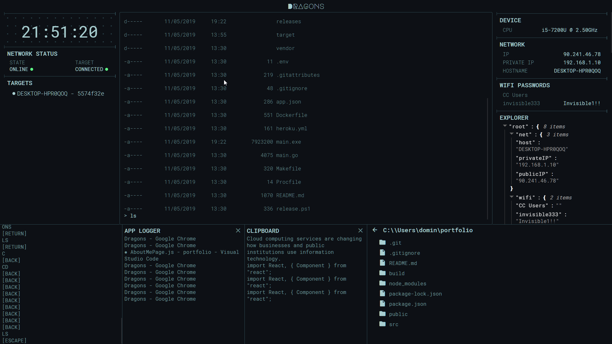
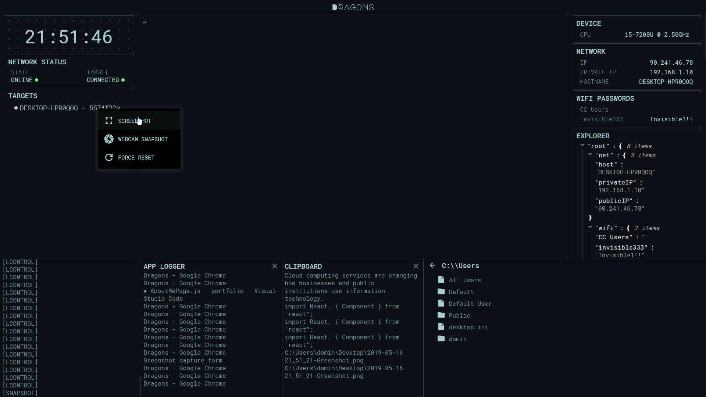

# Dragons




## Actions

Here is a list of actions / request types that are supported by the client. As the server is just be a simple framework allowing clients and targets to communicate with each other, each one of those features only need to be implemented by the client and the target. The following table only shows whether the feature has been implemented on the client, the built-in Go-based target is not included in the following table.

| Implemented? | Type                      | Description                                                          |
| ------------ | ------------------------- | -------------------------------------------------------------------- |
| ✅           | **DUMP_CLIPBOARD_LOG**    | Dump the clipboard log                                               |
| ✅           | **DUMP_KEY_LOG**          | Dump key log                                                         |
| ⬜️          | **DUMP_WINDOW_LOG**       | Window logger                                                        |
| ✅           | **EXEC**                  | Shell session executes a (powershell) command                        |
| ✅           | **FILE**                  | Receive file from client/target                                      |
| ✅           | **FORCE_RESET**           | Forces the target to do a hard reset of the target's dragons service |
| ⬜️          | **GET_VOLUME**            | Get audio volume                                                     |
| ✅           | **LS**                    | List files and directories in a given directory                      |
| ⬜️          | **NOTIFY**                | Display a notification to the user                                   |
| ⬜️          | **PLAY_AUDIO_FILE**       | Play audio from target's local file                                  |
| ⬜️          | **PLAY_AUDIO**            | Send audio file and play it                                          |
| ⬜️          | **RECORD_AUDIO_START**    | Play audio                                                           |
| ⬜️          | **RECORD_AUDIO_END**      | Stop recording audio,save it in a file and upload it                 |
| ⬜️          | **RECORD_AUDIO_DURATION** | Equivalent of RECORD_AUDIO_START, sleep x seconds, RECORD_AUDIO_END  |
| ✅           | **REQUEST_FILE**          | Requests file at a given path to be uploaded to server               |
| ⬜️          | **RUN_EXECUTABLE**        | Run executable on the target                                         |
| ⬜️          | **SET_VOLUME**            | Set audio volume                                                     |
| ✅           | **SCREENSHOT**            | Screenshot a screen                                                  |
| ✅           | **WEBCAM_SNAP**           | Snap a picture of the webcam                                         |
| ⬜️          | **WRITE_CLIPBOARD_TEXT**  | Write string to clipboard                                            |
| ⬜️          | **WRITE_CLIPBOARD_IMAGE** | Send image to clipboard                                              |

## This repo contains:

- an implementation of the **server** for the dragons infrastructure, built with Go.
- an implementation of the **client** that allows the user to interface with the framework, built with React and Typescript.

## This repo is not:

- malware. The only purpose of this is to provide penetration testers with a well built core framework they can use.

## Flow

```
(T) -> (S) CONNECT_TARGET / DISCONNECT
        |
    ____|_____  UPDATE_STATE
   |    |    |
  (C)  (C)  (C)

(C) -> (S) CONNECT_CLIENT   -   (C) will now listen for and receive UPDATE_STATE events

(C) -> (S) CONNECT_TO_TARGET(targetID)    -    If possible, devices will be connected and all their events will be passed through to each other

(C/T) -> (S) DISCONNECT   -   clear the connections / associations that involve the (C/T). Delete that (C/T) from the map, we don't need to keep track of terminated communications.

(C) <-> (S) <-> (T)    -    ACTION,   action usually started by (C) will go to the server and be passed through to (T) and the response, if there is any, will go back to (S) and be passed through to (C).

```

## Other Considerations

### Direct Peer-to-peer connection

Originally, I planned implementing [UDP hole punching](https://en.wikipedia.org/wiki/UDP_hole_punching) which would allow sending
messages directly between target and client in order to avoid that load on the server, especially on more bandwidth-heavy
real-time uses such as live screen video feed. This however wasn't an option if I wanted to use a web client. Only alternative would
be [WebRTC data channels](https://developer.mozilla.org/en-US/docs/Web/API/WebRTC_API/Using_data_channels) which on the other hand
doesn't have a great implementation for languages other than JS and even on the web it's only a draft at the moment. Final reason not
to use this is heavy bandwidth usage which might be noticed by the target / target's antivirus, so I decided to leave out the streaming
feature completely, but I might decide to test it out and see whether it's detectable.
